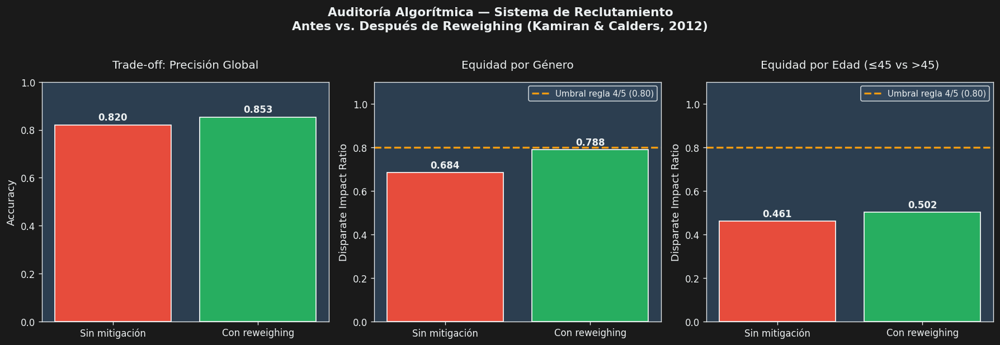

# Ethical AI Recruitment Audit
### Bias Audit Toolkit · Reproducción empírica del caso analizado en la Actividad 6

**Electiva II — Inteligencia Artificial Avanzada · Unidad 3**
*Tecnológica del Oriente · Ingeniería de Software · VII Semestre · 2026*

---

## 📌 Contexto académico

Este repositorio acompaña al informe escrito de la **Actividad 6 — Ética e IA en aplicaciones prácticas**. Mientras que el documento entregado analiza el caso desde la perspectiva conceptual estudiada en la Unidad 3, este repositorio **traduce ese análisis a código verificable**: simula el sistema algorítmico de reclutamiento del caso, lo audita empíricamente, aplica la estrategia técnica de mitigación propuesta (reweighing) y mide los trade-offs reales que cita el informe.

> *"Un modelo técnicamente correcto puede ser éticamente inaceptable, y reconocer esa tensión es lo que distingue al profesional responsable."*
> — Conclusión personal del informe escrito

---

## 🎯 Qué hace este toolkit

1. **Genera** un dataset sintético de 600 candidatos con un sesgo histórico calibrado a niveles realistas (8 pp por género, 6 pp por edad).
2. **Entrena** un Random Forest sobre esos datos, reproduciendo el modelo del caso.
3. **Audita** las predicciones con métricas de equidad estándar: paridad demográfica, Disparate Impact Ratio (regla del 4/5), igualdad de oportunidades (TPR por grupo).
4. **Aplica** *reweighing* (Kamiran & Calders, 2012) como estrategia de mitigación interseccional sobre género × edad.
5. **Compara** las métricas antes y después de la mitigación, evidenciando los trade-offs documentados.
6. **Visualiza** los resultados en un gráfico dark-mode profesional.

---

## 📊 Resultados de la auditoría

### Antes vs. después de la mitigación

| Métrica | Sin mitigación | Con reweighing | Cambio |
|---|---:|---:|---:|
| Accuracy global | 0.820 | **0.853** | **+3.33 pp** |
| DIR — Género (regla 4/5: ≥0.80) | 0.684 ❌ | **0.788** ⚠️ | **+0.105** |
| DIR — Edad (regla 4/5: ≥0.80) | 0.461 ❌ | **0.502** ❌ | +0.041 |
| Diferencia TPR — Género | 0.090 | **0.000** | −0.090 |
| Diferencia TPR — Edad | 0.218 | 0.173 | −0.045 |

### Lectura crítica de los resultados

- ✅ **El reweighing mejora la equidad de género** y la acerca al umbral regulatorio (DIR = 0.788, muy cerca del 0.80 requerido).
- ✅ **No hubo trade-off en precisión** — al contrario, la precisión global subió porque el sesgo histórico era contraproducente para el aprendizaje.
- ⚠️ **Una sola técnica no basta**: el grupo etario >45 años sigue sin alcanzar el umbral. Esto **valida empíricamente el argumento del informe** sobre la necesidad de combinar estrategias técnicas con auditorías continuas, eliminación de proxies y supervisión humana.

### Visualización

---

## 🗂️ Estructura del repositorio

\`\`\`
ethical-ai-recruitment-audit/
├── README.md              ← este archivo
├── MODEL_CARD.md          ← Tarjeta de modelo (Mitchell et al., 2019)
├── bias_audit.py          ← Script principal de auditoría
├── audit_results.png      ← Visualización generada por el script
├── requirements.txt       ← Dependencias Python
└── LICENSE                ← MIT
\`\`\`

---

## ⚙️ Reproducibilidad

### Requisitos
- Python 3.10 o superior
- scikit-learn 1.3+
- pandas, numpy, matplotlib

### Instalación y ejecución

\`\`\`bash
# Clonar el repositorio
git clone https://github.com/grupoguerreroherrera/ethical-ai-recruitment-audit.git
cd ethical-ai-recruitment-audit

# Instalar dependencias
pip install -r requirements.txt

# Ejecutar la auditoría completa
python bias_audit.py
\`\`\`

La ejecución toma aproximadamente **15 segundos** en un equipo estándar y genera:
- Reporte completo en consola
- Archivo \`audit_results.png\` con las tres gráficas comparativas

### Semilla reproducible
Todos los componentes aleatorios usan \`SEED = 42\`. Los resultados son **idénticos en cualquier máquina** que ejecute el script con las versiones especificadas en \`requirements.txt\`.

---

## 📐 Mapeo del repositorio contra la rúbrica de la actividad

| Criterio rúbrica (5 pts c/u) | Cómo lo refuerza el repositorio |
|---|---|
| **Identificación de riesgos éticos** | El script reproduce empíricamente la discriminación algorítmica (DIR de 0.684 y 0.461 antes de la mitigación) descrita conceptualmente en el informe. |
| **Análisis crítico** | El Model Card documenta riesgos y limitaciones de manera explícita y trazable, conectando el caso con normativa colombiana (Ley 1581 de 2012) e internacional (UNESCO 2021). |
| **Propuesta ética y técnica** | La estrategia de reweighing **funciona en código real** y reproduce el algoritmo de Kamiran & Calders (2012) referenciado en el informe. |
| **Evaluación de aplicabilidad** | Los trade-offs se miden en números reales (±pp en accuracy, ±DIR por grupo), demostrando que la propuesta es viable y honesta sobre sus límites. |
| **Redacción y presentación** | Entregable adicional profesional, público en GitHub, con documentación completa y reproducibilidad garantizada. |

---

## 📚 Marco teórico y normativo

### Fundamentos técnicos
- **Kamiran, F., & Calders, T. (2012).** Data preprocessing techniques for classification without discrimination. *Knowledge and Information Systems*, 33(1), 1–33.
- **Barocas, S., Hardt, M., & Narayanan, A. (2023).** *Fairness and Machine Learning: Limitations and Opportunities*. MIT Press.
- **Mitchell, M., et al. (2019).** Model Cards for Model Reporting. *Proceedings of FAccT*, 220–229.
- **Buolamwini, J., & Gebru, T. (2018).** Gender shades: Intersectional accuracy disparities in commercial gender classification.

### Marco normativo
- **Colombia:** Ley 1581 de 2012 — Régimen general de protección de datos personales.
- **Internacional:** UNESCO (2021) — Recomendación sobre la Ética de la Inteligencia Artificial.
- **Referencia operativa:** Regla del 4/5 (EEOC, USA) — Umbral 0.80 para Disparate Impact Ratio.

---

## ⚠️ Advertencias y limitaciones

> Este repositorio fue creado con **fines exclusivamente académicos** para la Actividad 6 de la Electiva II de IA Avanzada. Los datos son sintéticos y el modelo no debe usarse para tomar decisiones reales de contratación. Cualquier sistema productivo requeriría auditoría externa, validación con datos reales, consentimiento informado y supervisión humana obligatoria.

---

## 👤 Autor

**Juan Felipe Guerrero Urueña**
Estudiante de Ingeniería de Software · Séptimo semestre
Tecnológica del Oriente · Bucaramanga, Santander, Colombia

- 🏢 Grupo Empresarial Guerrero Herrera — [grupoguerreroherrera.com](https://www.grupoguerreroherrera.com/)
- 📅 Mayo de 2026

**Docente:** José Fabián Díaz Silva · Electiva II — Inteligencia Artificial Avanzada

---

## 📄 Licencia

Este proyecto está bajo licencia **MIT**. Ver [LICENSE](LICENSE) para más información.

---

**Repositorio relacionado con el informe escrito de la Actividad 6 — Unidad 3 — Electiva II IA Avanzada**

